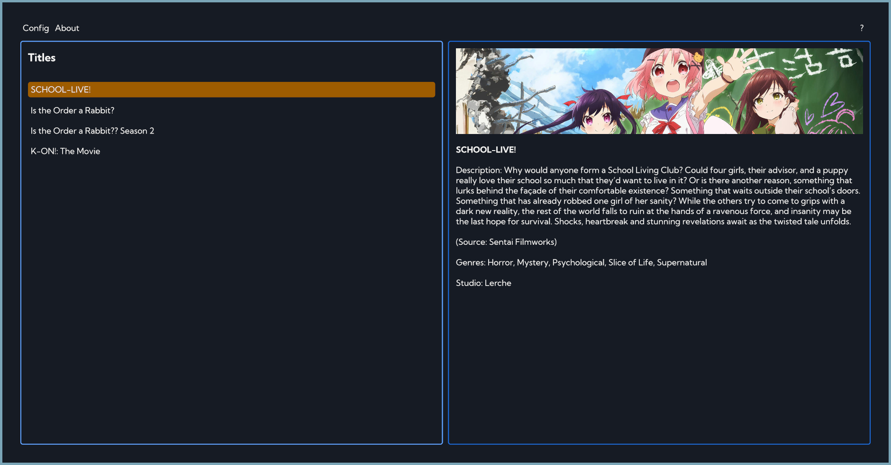

    
    <h3 align="center"><b><i>So pretty, so yama</i></b></h3>

# **yama**

**yama** will automatically organize your local animes, displaying them in a neatly manner and keep watch of where you left out watching!

## Index:
- [Usage](#usage)
- [Config](#config-paths)
- [Dependencies](#dependencies)

## Usage:
**yama** will search with the [Anilist API](https://anilist.gitbook.io/anilist-apiv2-docs/) for information about the animes based on the name of the folder, so if for some reason it cannot found info about the anime try renaming it to something more close to the original title.

Once entered in a title, **yama** will proceed to generate the metadata for each episode, this will probably take a bit of time depending on the amount of episodes and its size, but its only the first time, after that **yama** will cache the results in a hidden folder inside the title called _'.metadata'_.

**yama** will also keep saved at what time you left an episode, and if you finish it watching it will mark it as such, so you can always remember where you left off an anime.

You will also have these three functions for ease of use:

    

- **Refresh**: Will refresh the generate metadata for that title in case you have added more episodes and they are not visible in the program.
- **Mark as watched**: To quickly mark an episode as watched/unwatched.
- **Mark all previous as watched**: To mark all previous episodes before the selected one as watched/unwatched.

## Config paths:
- _Linux_: $HOME/.config/yama
- _Windows_: %appdata%/Roaming/yama

> If any errors occurred while using **yama** you can generate a new issue with the output of the last log file located in the config's log folder.

    

## Dependencies:

**yama** requires **ffmpeg** and **mpv** to work, for linux users you can install it with your packet manager, but for windows users there is a _dependencies.ps1_ script in the [Release](https://github.com/yama-org/yama/releases) zip, it will download both programs and add it to the user _Path_.

    

